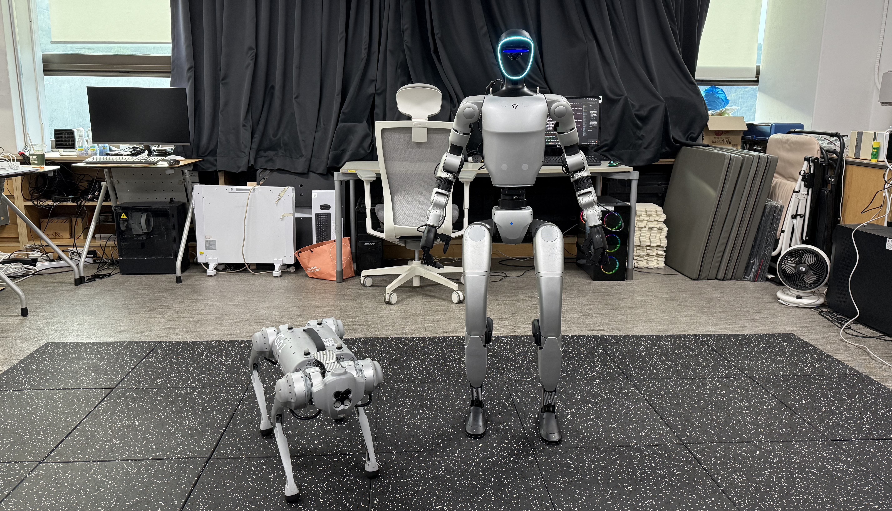
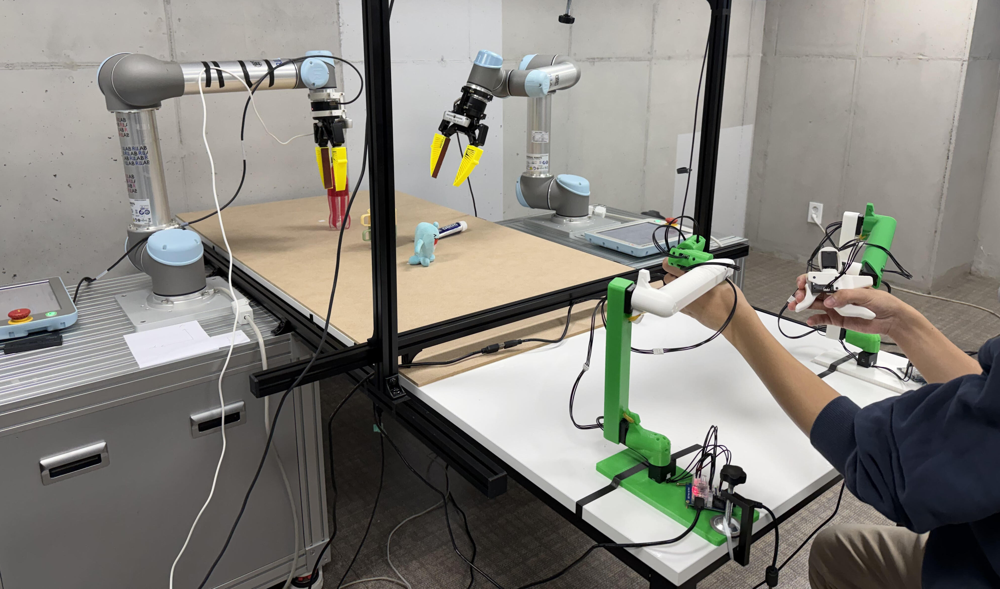
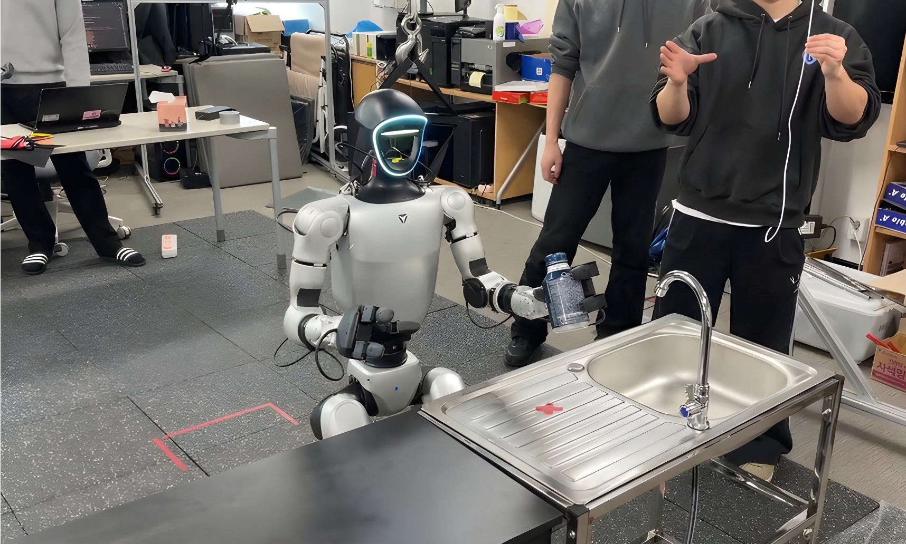
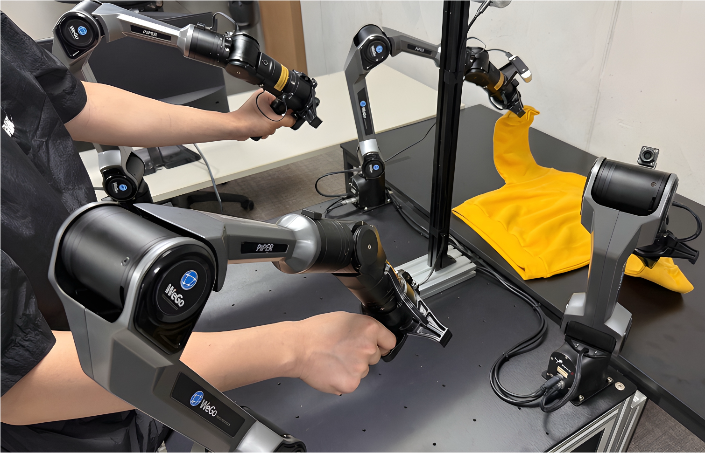
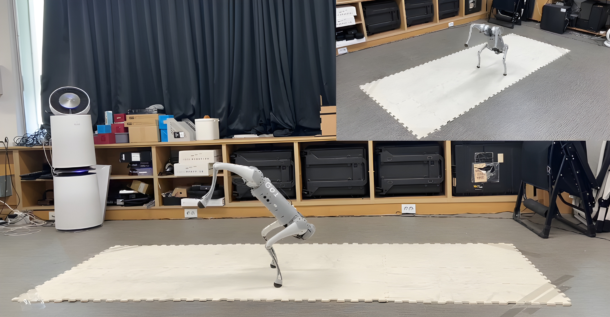
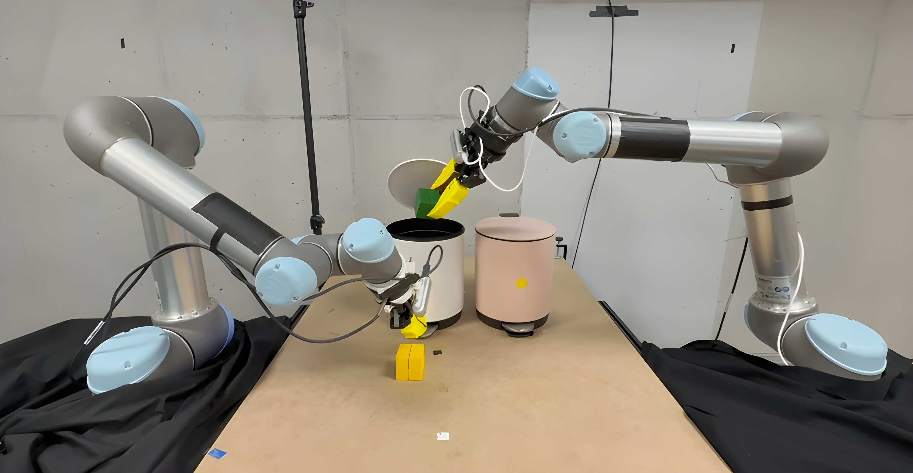

# Robot Learning Laboratory

  

    
    
    
    
    
    
    
  

Department of Electrical and Computer Engineering, ASRI, Seoul National University 

  <a class="custom-home-button custom-home-button-light" href="https://rllab.snu.ac.kr">Homepage</a>
  <a class="custom-home-button custom-home-button-dark" href="https://www.youtube.com/c/RobotLearningLaboratory">
    <svg viewBox="0 0 24 24" aria-hidden="true">
      <path fill="currentColor" d="M23.5 6.2a3 3 0 0 0-2.1-2.1C19.5 3.5 12 3.5 12 3.5s-7.5 0-9.4.6A3 3 0 0 0 .5 6.2 31.2 31.2 0 0 0 0 12a31.2 31.2 0 0 0 .5 5.8 3 3 0 0 0 2.1 2.1c1.9.6 9.4.6 9.4.6s7.5 0 9.4-.6a3 3 0 0 0 2.1-2.1A31.2 31.2 0 0 0 24 12a31.2 31.2 0 0 0-.5-5.8ZM9.6 15.6V8.4L16 12l-6.4 3.6Z"/>
    </svg>
    Youtube
  </a>
  <a class="custom-home-button custom-home-button-dark" href="https://github.com/rllab-snu">
    <svg viewBox="0 0 24 24" aria-hidden="true">
      <path fill="currentColor" d="M12 .5a12 12 0 0 0-3.8 23.4c.6.1.8-.2.8-.6v-2c-3.3.7-4-1.4-4-1.4a3.1 3.1 0 0 0-1.3-1.8c-1-.7.1-.7.1-.7a2.5 2.5 0 0 1 1.8 1.2 2.6 2.6 0 0 0 3.5 1 2.6 2.6 0 0 1 .8-1.6c-2.7-.3-5.5-1.3-5.5-6a4.7 4.7 0 0 1 1.2-3.2 4.3 4.3 0 0 1 .1-3.1s1-.3 3.3 1.2a11.3 11.3 0 0 1 6 0c2.3-1.5 3.3-1.2 3.3-1.2a4.3 4.3 0 0 1 .1 3.1 4.7 4.7 0 0 1 1.2 3.2c0 4.7-2.8 5.7-5.5 6a2.9 2.9 0 0 1 .8 2.2v3.2c0 .4.2.7.8.6A12 12 0 0 0 12 .5Z"/>
    </svg>
    Github
  </a>

