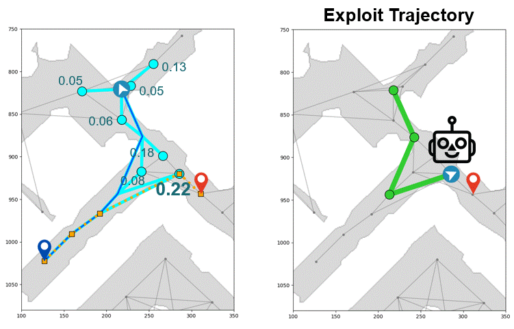

# Meta-Explore: Exploratory Hierarchical Vision-and-Language Navigation Using Scene Object Spectrum Grounding
{: .fw-700 }
*Minyoung Hwang*<sup>1</sup>, *Jaeyeon Jeong*<sup>1</sup>, *Minsoo Kim*<sup>3</sup>, *Yoonseon Oh*<sup>2</sup>\*, *Songhwai Oh*<sup>1</sup>\*

<sup>1</sup>Electrical and Computer Engineering and ASRI, Seoul National University, <sup>2</sup>Department of Electronic Engineering, Hanyang University, <sup>3</sup>Interdisciplinary Major in Artificial Intelligence, Seoul National University

*Corresponding authors
{: .fs-2 }

CVPR 2023 accepted
{: .text-green-100 }

[Paper](){: .btn  .btn-purple}
[Video](){: .btn .btn-blue}
[Code](){: .btn .btn-green}

### <p style="text-align:center"><span style="color:#34568B">Abstract</span></p>
The main challenge in vision-and-language navigation (VLN) is how to understand natural-language instructions in an unseen environment. The main limitation of conventional VLN algorithms is that if an action is mistaken, the agent fails to follow the instructions or explores unnecessary regions, leading the agent to an irrecoverable path. To tackle this problem, we propose Meta-Explore, a hierarchical navigation method deploying an exploitation policy to correct misled recent actions. We show that an exploitation policy, which moves the agent toward a well-chosen local goal among unvisited but observable states, outperforms a method which moves the agent to a previously visited state. We also highlight the demand for imagining regretful explorations with semantically meaningful clues. The key to our approach is understanding the object placements around the agent in spectral-domain. Specifically, we present a novel visual representation, called scene object spectrum (SOS), which performs category-wise 2D Fourier transform of detected objects. Combining exploitation policy and SOS features, the agent can correct its path by choosing a promising local goal. We evaluate our method in three VLN benchmarks: R2R, SOON, and REVERIE. Meta-Explore outperforms other baselines and shows significant generalization performance. In addition, local goal search using the proposed spectral-domain SOS features significantly improves the success rate by 17.1% and SPL by 20.6% for the SOON benchmark.

<br /><br />
### <p style="text-align:center"><span style="color:#34568B">Illustration of Meta-Explore:rocket:</span></p><br />


At each episode, a natural language instruction is given to the agent to navigate to a goal location. The agent explores the environment and constructs a topological map by recording visited nodes and next step reachable nodes. The agent chooses an unvisited local goal to solve the regretful exploration problem.

<style>
td, th {
   border: none!important;
}
</style>

<div align="center">
    <table >
     <tr>
        <td><b><span style="color:#CB1C8D">Hierarchical Exploration</span></b></td>
        <td><b><span style="color:#CB1C8D">Local Goal Search</span></b></td>
        <td><b><span style="color:#CB1C8D">Scene Object Spectrum</span></b></td>
     </tr>
     <tr>
        <td>
        <span style="font-size:10px;line-height:1.0em;">
        We propose a hierarchical navigation method deploying a
        learnable mode selector.</span> 
        </td>
        <td>
        <span style="font-size:10px;line-height:1.0em;">
        The exploitation policy finds an unvisited and near-optimal local goal instead of simply backtracking.</span>
        </td>
        <td>
        <span style="font-size:10px;line-height:1.0em;">
        We assert the necessity of spectral grounding of objects in hierarchical exploration.</span>
        </td>
     </tr>
    </table>
</div>

---

### <p style="text-align:center"><span style="color:#34568B">Hierarchical Exploration</span></p>
#### Hierarchical Exploration
<p style="text-align:center"></p>

Meta-Explore is a hierarchical navigation method deploying an exploitation policy to correct misled recent actions. 

<br />
#### Local Goal Search
<div align="center">
    <table >
     <tr>
        <td><b><p style="text-align:right"><span style="color:#CB1C8D">Traditional Exploitation Methods</span></p></b></td>
        <td><b><p style="text-align:center"><span style="color:#CB1C8D">&nbsp;&nbsp;&nbsp;&nbsp;&nbsp;&nbsp;&nbsp;&nbsp;&nbsp;&nbsp;&nbsp;&nbsp;&nbsp;&nbsp;&nbsp;&nbsp;&nbsp; Our Solution</span></p></b></td>
     </tr>
     <tr>
        <td>
        <p style="text-align:center"></p>
        </td>
        <td>
        <p style="text-align:center"></p>
        </td>
     </tr>
    </table>
</div>

We show that an exploitation policy, which moves the agent toward a **well-chosen local goal** among **unvisited but observable states**, outperforms a method which moves the agent to a previously visited state.

---
### <p style="text-align:center"><span style="color:#34568B">Scene Object Spectrum</span></p>
<p style="text-align:center"></p>

Meta-Explore imagines regretful explorations with **semantically meaningful clues**. We present a **novel** visual representation, called **scene object spectrum (SOS)**, which performs **category-wise 2D Fourier transform** of detected objects.

---
### <p style="text-align:center"><span style="color:#34568B">Toy Example</span></p>

<div align="center">
    <table >
     <tr>
        <td style="width:40%">
        <p style="text-align:center"></p>
        </td>
        <td>
        Combining the exploitation policy and SOS features, the agent can correct its path by choosing a <span style="font-weight:bold">promising local goal</span>. We score the corrected trajectories to measure the alignment with the language instruction L.
        </td>
     </tr>
    </table>
</div>
<p style="text-align:center"></p>

---
### <p style="text-align:center"><span style="color:#34568B">Experiments in Discrete Environments</span></p>

#### VLN Benchmark - R2R
<p style="text-align:center"></p>

Meta-Explore outperforms other baselines and shows significant **generalization performance**.

#### Exploitation via Local Goal Search
<p style="text-align:center"></p>

**Local goal search** using the proposed **spectral-domain SOS features** significantly improves the **success rate** and **SPL**.

---
### <p style="text-align:center"><span style="color:#34568B">Experiments in Continuous Environments</span></p>

#### Image-Goal Navigation
<p style="text-align:center"></p>

We extend Meta-Explore to **image-goal navigation task** in continuous environments to address the impact of **hierarchical exploration** in realistic environments.

<!-- #### VLN-CE -->

---
#### <p style="text-align:left"><span style="color:#34568B">Bibtex</span></p>
```
@inproceedings{2023metaexplore,
  title={Meta-Explore: Exploratory Hierarchical Vision-and-Language Navigation Using Scene Object Spectrum Grounding},
  author={Hwang, Minyoung and Jeong, Jaeyeon and Kim, Minsoo and Oh, Yoonseon and Oh, Songhwai},
  booktitle={Proceedings of the IEEE/CVF Conference on Computer Vision and Pattern Recognition},
  year={2023}
}
```